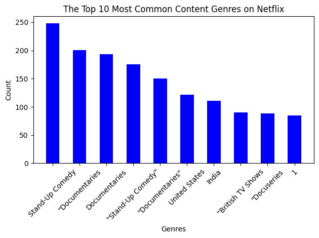
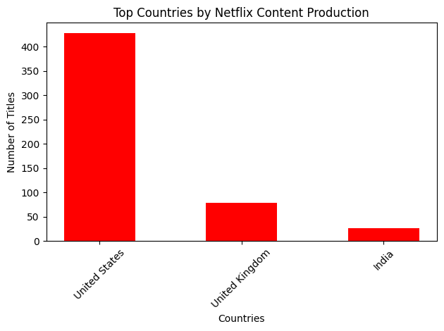
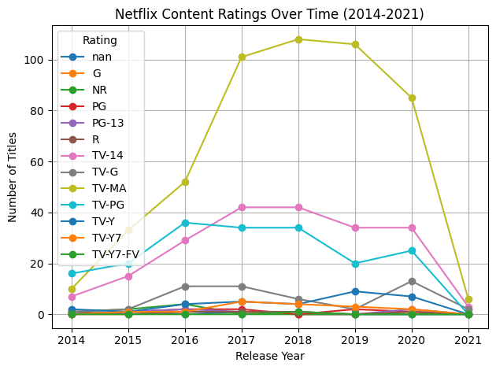

# Exploring Global Netflix Trends with AWS Athena and Glue

This project analyzes Netflix's TV shows and movies using a serverless AWS data pipeline. The goal is to explore content trends including genre popularity, country of production, and rating distribution over time.

## Tools Used

- **AWS S3**: Data storage for the Netflix dataset (from Kaggle).
- **AWS Glue**: Used Glue Crawler to create a table schema automatically in the Data Catalog.
- **AWS Athena**: Queried the dataset directly using standard SQL.
- **VS Code + Python**: Used Pandas and Seaborn for minimal visualization.

## Dataset

- Source: [Kaggle - Netflix TV Shows and Movies]https://www.kaggle.com/datasets/senapatirajesh/netflix-tv-shows-and-movies
- Files: `NetFlix.csv`, `genres_result.csv`, `country_result.csv`, `rating_result.csv`

## Project Workflow

1. **Download and Upload**:

   - Download dataset locally from Kaggle
   - Upload the csv file to an AWS S3 bucket

2. **Schema Inference**:

   - Created a Glue Crawler to automatically infer schema and create a table named `netflix_db.netflix_data`

3. **SQL Querying with Athena**:

   - Connected to the Glue catalog
   - Wrote SQL queries to explore the following research questions:
     - 1. **What are the top 10 most common content genres on Netflix?**
     - 2. **Which countries have produced the most Netflix content?**
     - 3. **How have content ratings changed from 2014 to 2021?**

4. **Visualization**:
   - Plotted bar charts and trend lines using Matplotlib
   - Showing the results   
